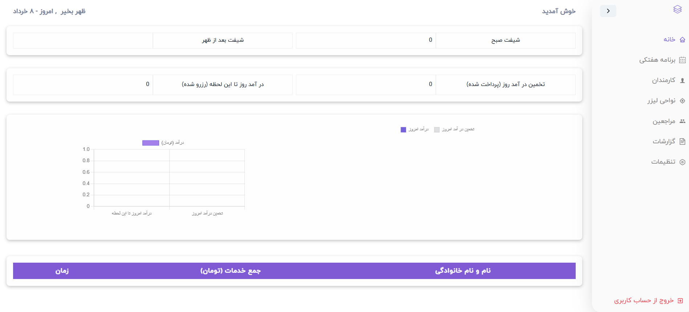
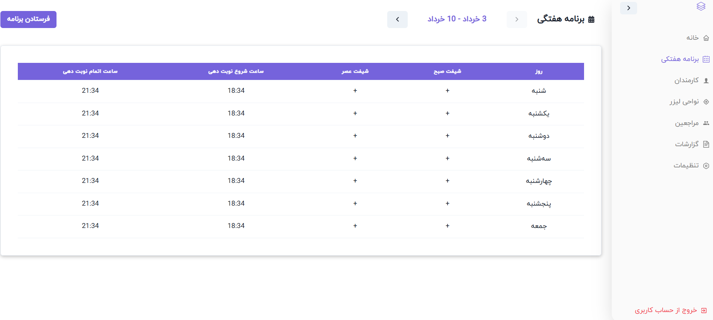
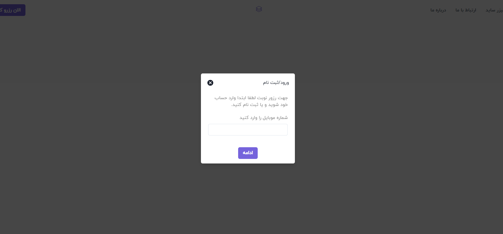
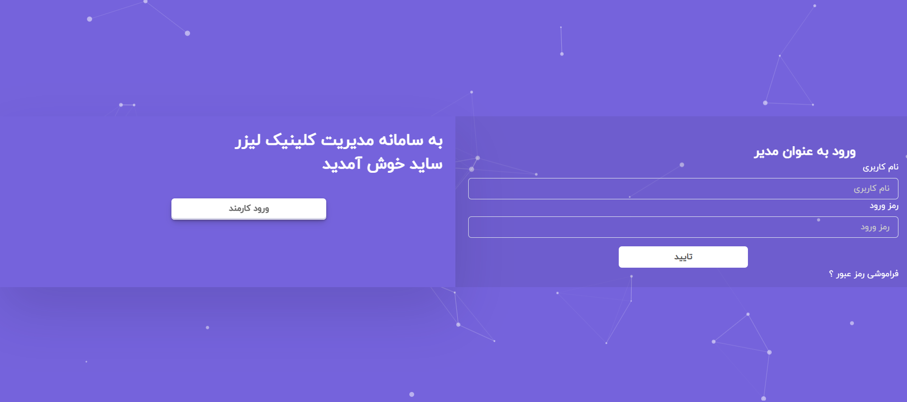
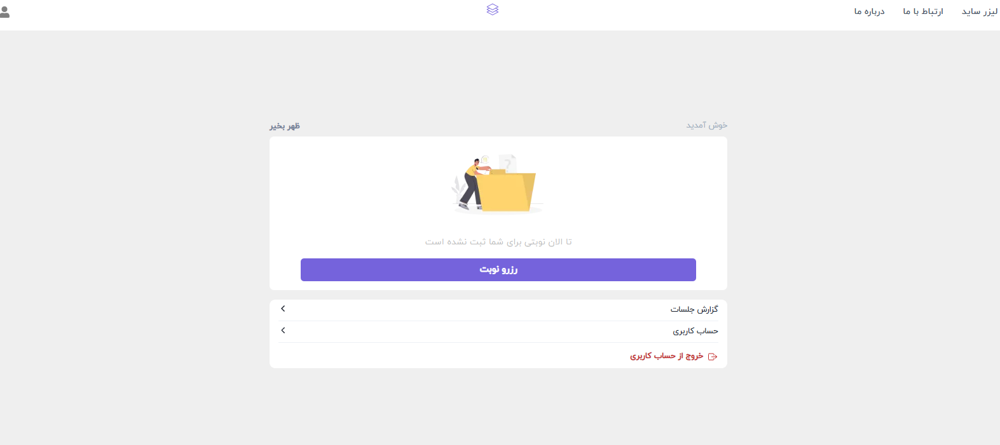
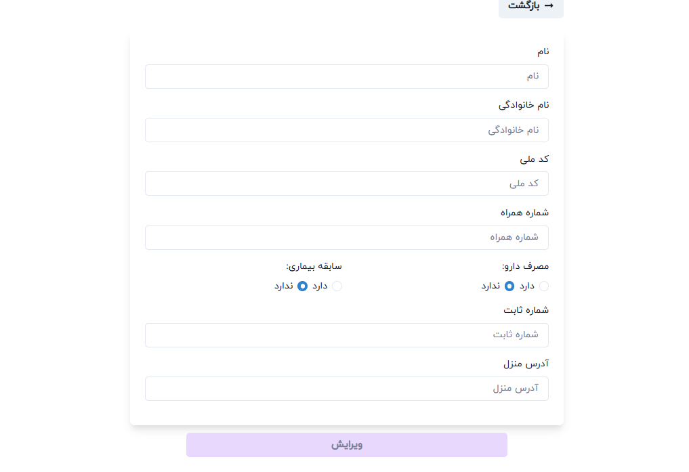
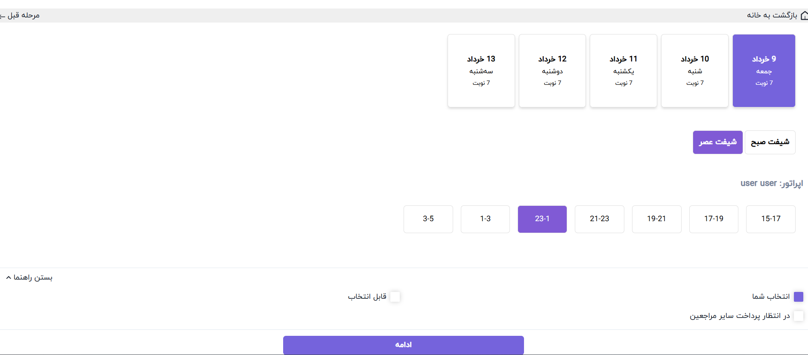
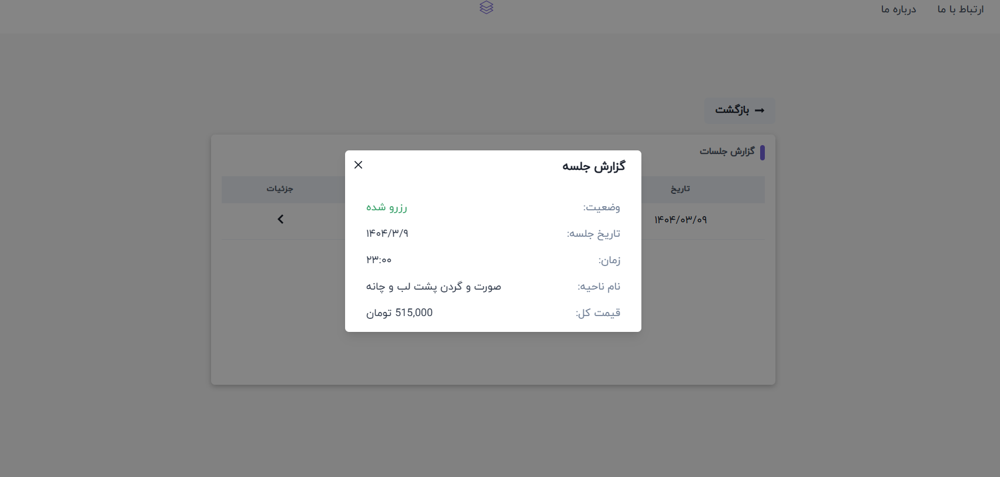

<div align="center">


<div>
    
    
    
    
    
    
    
    
    
    
    
    
</div>

  <h3 align="center"> Laser Hair Removal Clinic</h3>

</div>

## 📋 <a name="table">Table of Contents</a>

1. 🤖 [Introduction](#introduction)
2. ⚙️ [Tech Stack](#tech-stack)
3. 🔋 [Features](#features)
4. 📂 [Project structure](#project-structure)
5. 🕸️ [Code to Copy](#snippets)
6. 🔗 [Assets](#links)

## <a >🖼️ Admin and Auth</a>

<div align="center">
  <table>
    <tr>
   <td></td>
   <td></td>
    </tr>
    <tr>
      <td></td>
     <td></td>
    </tr>
  </table>
</div>

## <a >🖼️ Customer Dashboard</a>

<div align="center">
  <table>
    <tr>
   <td></td>
   <td></td>
    </tr>
    <tr>
      <td></td>
     <td></td>
    </tr>
  </table>
</div>

## <a name="introduction">🤖 Introduction</a>

This platform is specially designed for laser hair removal clinics to make the work easier for admins, receptionists, and clients.
It includes three separate dashboards, each made for a different type of user:
Admin Dashboard,
Receptionist Dashboard and
Client Dashboard,
Each dashboard has its own features that help manage daily tasks, improve communication, and make the overall process faster and more organized.
More details about each dashboard and its features are provided below.

## <a name="tech-stack">⚙️ Tech Stack</a>

- NextJs
- Redux
- Chakra Ui
- axios
- Framer Motion
- Formik
- Chart.Js
- Python
- Django
- Postgresql

## <a name="features">🔋 Features</a>

👉 **Dual Authentication System**

- **Users** sign in using their **mobile phone number** and a **one-time verification code (OTP)** for secure and seamless access.
- **Admins and Receptionists** log in using a **username and password** for role-based authentication and access control.

👉 **Multi-role Dashboards** Three separate dashboards tailored for admin, receptionist, and client roles.

👉 **Advanced Data Visualization**
Admins can track performance and trends with interactive charts and graphs.

👉 **End-to-End Booking Flow**
Clients can easily complete the entire reservation process within the platform.

Reporting: Access personalized reports for reservation history and service usage.

👉 **Comprehensive Activity Reports** Admins have full access to detailed logs of all client interactions and bookings.

**Prerequisites**
Make sure you have the following installed on your machine:

- [Git](https://git-scm.com/)
- [Node.js](https://nodejs.org/en)
- [npm](https://www.npmjs.com/) (Node Package Manager)

**Cloning the Repository**

```bash
git clone https://github.com/RezaFarzipour/Metallugical_Research_Center
cd portfolio
```

**Installation**

Install the project dependencies using npm:

```bash
npm install
```

**Running the Project**

```bash
npm run dev
```

Open [http://localhost:3000](http://localhost:3000) in your browser to view the project.

## <a name="project-structure">📂 Project Structure</a>

```ts
src/
├── Common/{attentionModal,backToUp,customeButton,formController,loading,searchInput,sectionTitle}
├── Components/
│   ├── aboutUs/{index,ui}
│   ├── adminDashboard/
│   │   ├── areaLazer/{index,logic,ui}
│   │   ├── clientsPage/{Clients,logic}
│   │   ├── employees/{index,logic,ui}
│   │   ├── homePage/{index,logic,ui/{CustomerTable,HeaderDetails,charts,financialReports}}
│   │   ├── reportsPage/{index,logic,ui/{ReportHeader,ReportItem,charts}}
│   │   ├── settingPage/{index,logic,ui}
│   │   ├── shared/{AccordionLists,AdminHeader,Inputs,Lists,ReussableSession}
│   │   ├── modals/{ModalAttention,ModalDefine}
│   │   ├── utils
│   │   └── weeklyCalendar/{index,logic,ui}
│   ├── auth/{loginReception&Admin/{index,logic,ui},signinModal/{index,logic,ui}}
│   ├── contactUs/{index,ui}
│   ├── landing/{banner,faqs,guideSignup,header,laserBefore,whyLaser}
│   ├── reseptionDashboard/{DailyShift,layout,ResClients,AddPatientWithoutTime,enterExiteOperator,headerDetails,paidTurnList,patientList,paymentDialog,reservationList,shared}
│   └── userDashboard/{layout,areasChoice,dashboardLayout,dateTime,form,informationConfirm,reservationDone,shared,stepper,turnsReport,utils}
├── constants/index.js
├── features/{logOutSlice,store,adminDashboard,customerDashboard,dashboardSteper,receptionDashboard,signin}
├── Layout/{index,Style,drawer,footer,navbar,sidebar}
├── pages/{404,aboutUs,contactUs,index,panel,signInCustomer,_app,_document,adminDashboard,api,reseptionDashboard,userDashboard}
├── services/apiService.js
├── styles/{globals.css,Home.module.css,Theme.js}
├── utils/{BackToUp,extractDate,findSlug,formatNumber,getCustomerName,toPersianDigits,useCustomToast}
└── widget/Logo.js


```

## <a name="links">🔗 Assets</a>

Assets used in the project can be found [here](https://Emdaportfolio.com)
